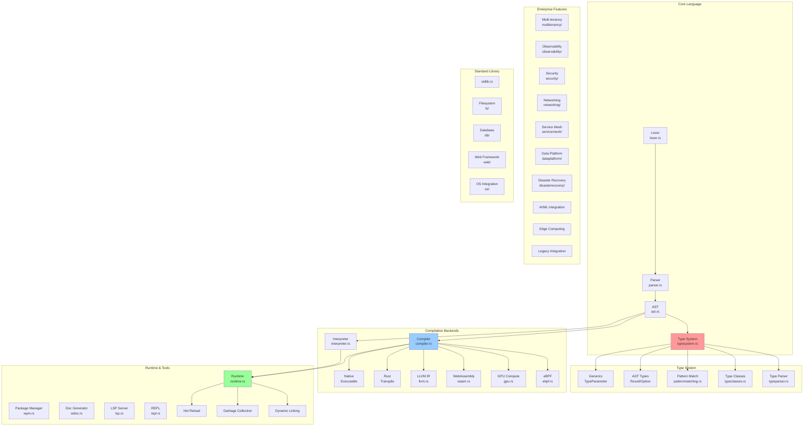
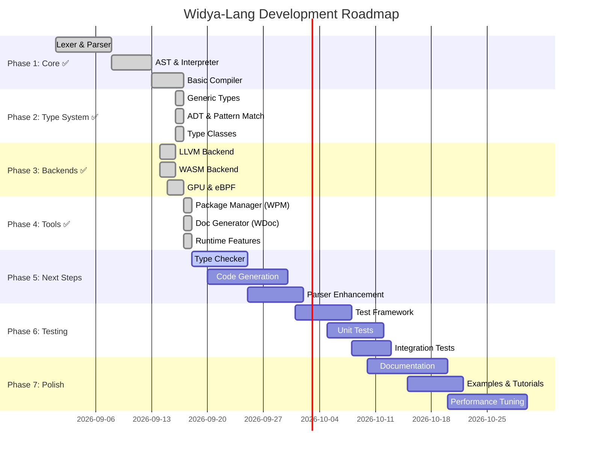
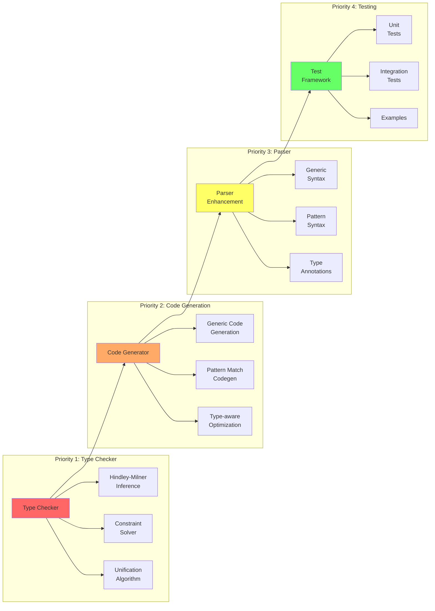
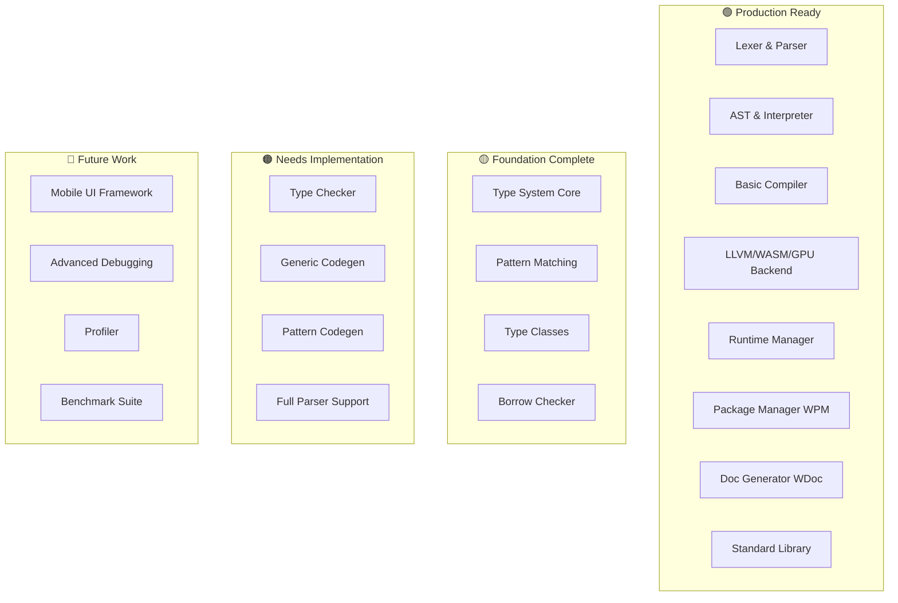
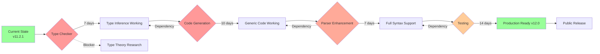
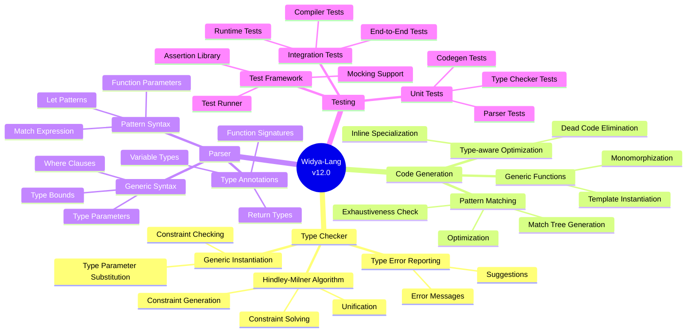
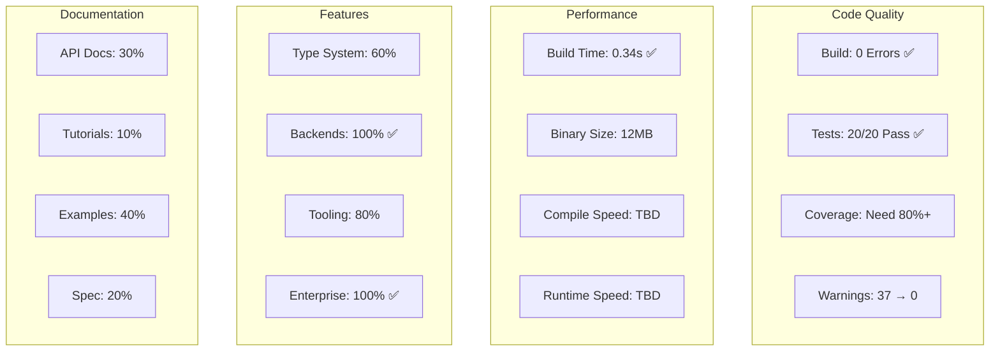
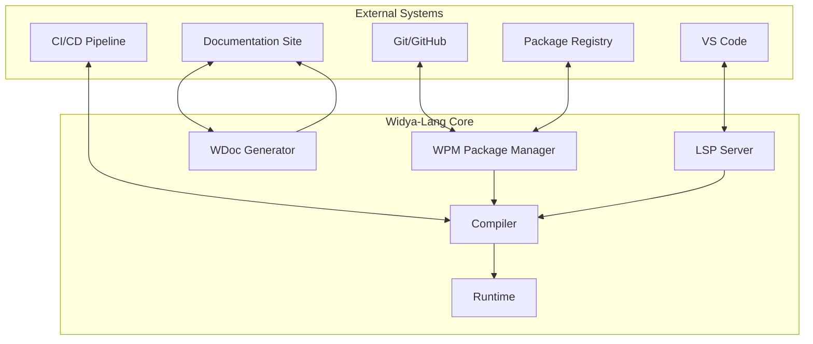

# 🗺️ Widya-Lang Project Graph & Roadmap

## 📊 Project Architecture Graph

## 🎯 Development Phases Graph

## 🔄 Feature Dependency Graph

## 📈 Module Maturity Matrix

## 🛣️ Critical Path Analysis

## 📋 Task Breakdown Graph

## 🎯 Success Metrics Dashboard

## 🔗 Integration Points

## 📊 Progress Tracking

| Phase | Status | Progress | ETA |
|-------|--------|----------|-----|
| Core Language | ✅ Done | 100% | Complete |
| Type System Foundation | ✅ Done | 100% | Complete |
| Compilation Backends | ✅ Done | 100% | Complete |
| Runtime & Tools | ✅ Done | 100% | Complete |
| Type Checker | 🔴 Todo | 0% | 2026-09-25 |
| Code Generation | 🔴 Todo | 0% | 2026-10-05 |
| Parser Enhancement | 🔴 Todo | 0% | 2026-10-12 |
| Testing Framework | 🔴 Todo | 0% | 2026-10-20 |
| Documentation | 🟡 In Progress | 30% | 2026-10-30 |

## 🎯 Next 30 Days Roadmap

**Week 1 (Sep 18-24): Type Checker**
- Day 1-2: Research Hindley-Milner algorithm
- Day 3-4: Implement unification
- Day 5-6: Implement constraint solver
- Day 7: Testing & debugging

**Week 2 (Sep 25-Oct 1): Code Generation**
- Day 8-9: Generic function monomorphization
- Day 10-11: Pattern match code generation
- Day 12-13: Type-aware optimizations
- Day 14: Integration testing

**Week 3 (Oct 2-8): Parser Enhancement**
- Day 15-16: Generic syntax support
- Day 17-18: Pattern syntax support
- Day 19-20: Type annotation syntax
- Day 21: End-to-end testing

**Week 4 (Oct 9-15): Testing & Polish**
- Day 22-24: Build test framework
- Day 25-26: Write comprehensive tests
- Day 27-28: Documentation
- Day 29-30: Bug fixes & optimization

---

**Last Updated:** 2026-09-17  
**Version:** v11.2.1  
**Status:** 🟢 On Track
